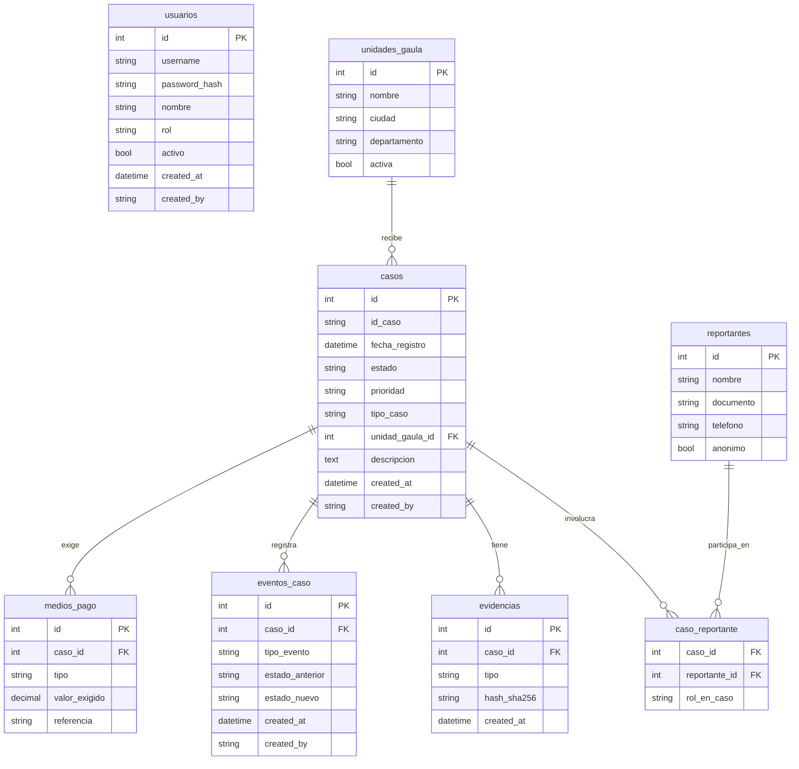
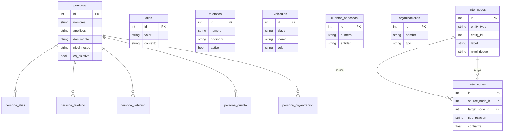
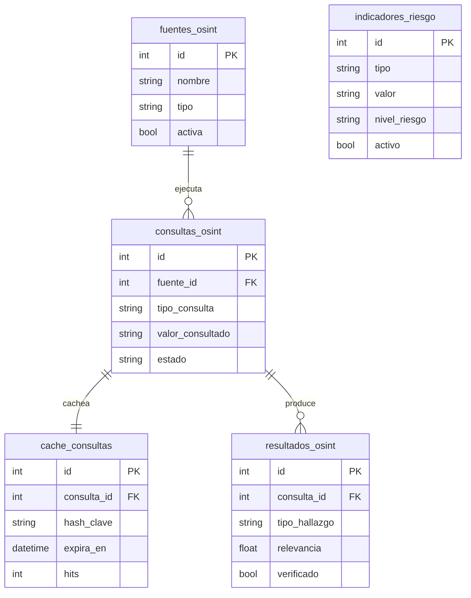

# NEXO-147 — Rediseño de Base de Datos para Inteligencia y Análisis Relacional

**Fecha:** 2026-06-03
**Fase:** Demo (SQLite)
**Stack:** Flask + Flask-SQLAlchemy + SQLite

---

## 1. Contexto y Problema

La plataforma NEXO-147 actualmente almacena todos los datos de denuncias en una única tabla `reportes` con campos de texto plano. Esto impide:

- Correlacionar un número telefónico entre múltiples casos
- Identificar que un alias aparece en distintas investigaciones
- Trazar relaciones entre personas, vehículos y cuentas bancarias
- Realizar análisis de inteligencia sobre entidades reutilizables

El rediseño normaliza la estructura y la separa en tres bases de datos independientes con responsabilidades distintas.

---

## 2. Arquitectura General

### Tres bases independientes con `SQLALCHEMY_BINDS`

```python
SQLALCHEMY_DATABASE_URI = "sqlite:///data/nexo147.db"   # bind default
SQLALCHEMY_BINDS = {
    "intel": "sqlite:///data/intel.db",
    "osint": "sqlite:///data/osint.db",
}
```

Cada modelo Flask-SQLAlchemy declara su base con `__bind_key__`. Las FK cruzadas entre bases no existen en SQLite — los vínculos entre bases se resuelven en la capa de servicio Python.

### Responsabilidades por base

| Base | Dominio | Quién escribe | Quién lee |
|---|---|---|---|
| `nexo147.db` | Operativo — casos, usuarios, eventos | Operador, Admin | Director, Analista, Admin |
| `intel.db` | Inteligencia — entidades, relaciones, grafo | Analista, Admin | Director, Analista |
| `osint.db` | OSINT — caché de APIs externas | Sistema (automático) | Analista, Admin |

### Flujo de información

```
nexo147.db  →  intel.db  →  osint.db
   ↓               ↓              ↓
Caso registrado  Entidades     Búsqueda OSINT
por operador     extraídas     sobre entidad
                 por analista  → alerta si es
                               indicador conocido
```

---

## 3. Esquema `nexo147.db` (Dominio Operativo)

### Campos de auditoría (presentes en todas las tablas)

Todas las tablas incluyen: `created_at DATETIME`, `updated_at DATETIME`, `created_by VARCHAR(50)`, `updated_by VARCHAR(50)`.

### `usuarios`

Evolución de la tabla actual — agrega campos de auditoría.

| Campo | Tipo | Restricciones |
|---|---|---|
| `id` | INTEGER | PK |
| `username` | VARCHAR(50) | UNIQUE NOT NULL |
| `password_hash` | VARCHAR(256) | NOT NULL |
| `nombre` | VARCHAR(100) | NOT NULL |
| `rol` | VARCHAR(20) | NOT NULL — admin/director/analista/operador |
| `activo` | BOOLEAN | DEFAULT TRUE |

### `unidades_gaula`

Catálogo de unidades GAULA receptoras. Normaliza el campo de texto `unidad_gaula` de la tabla actual.

| Campo | Tipo | Restricciones |
|---|---|---|
| `id` | INTEGER | PK |
| `nombre` | VARCHAR(100) | UNIQUE NOT NULL |
| `ciudad` | VARCHAR(100) | |
| `departamento` | VARCHAR(100) | |
| `activa` | BOOLEAN | DEFAULT TRUE |

### `casos`

Reemplaza `reportes`. Solo metadatos del caso — los datos relacionales van en tablas propias.

| Campo | Tipo | Restricciones |
|---|---|---|
| `id` | INTEGER | PK |
| `id_caso` | VARCHAR(36) | UNIQUE NOT NULL (hereda `id_reporte`) |
| `fecha_registro` | DATETIME | DEFAULT now |
| `fecha_actualizacion` | DATETIME | |
| `estado` | VARCHAR(20) | DEFAULT 'Recibido' |
| `prioridad` | VARCHAR(20) | Baja/Media/Alta/Crítica |
| `tipo_caso` | VARCHAR(50) | Extorsión/Secuestro/Amenaza/... |
| `canal_recepcion` | VARCHAR(50) | Línea 147/Web/Presencial |
| `unidad_gaula_id` | INTEGER | FK → `unidades_gaula.id` |
| `descripcion` | TEXT | |
| `observaciones` | TEXT | |

**Índices:** `estado`, `prioridad`, `tipo_caso`, `fecha_registro`

### `reportantes`

Quién denuncia — antes campos planos en `reportes`.

| Campo | Tipo | Restricciones |
|---|---|---|
| `id` | INTEGER | PK |
| `nombre` | VARCHAR(100) | |
| `documento` | VARCHAR(30) | |
| `telefono` | VARCHAR(20) | |
| `anonimo` | BOOLEAN | DEFAULT FALSE |

**Índices:** `documento`, `telefono`

### `caso_reportante` *(M:M)*

| Campo | Tipo | Restricciones |
|---|---|---|
| `caso_id` | INTEGER | FK → `casos.id` |
| `reportante_id` | INTEGER | FK → `reportantes.id` |
| `rol_en_caso` | VARCHAR(50) | víctima/testigo/denunciante |

### `evidencias`

| Campo | Tipo | Restricciones |
|---|---|---|
| `id` | INTEGER | PK |
| `caso_id` | INTEGER | FK → `casos.id` |
| `tipo` | VARCHAR(50) | audio/imagen/documento/captura |
| `descripcion` | VARCHAR(200) | |
| `ruta_archivo` | VARCHAR(500) | |
| `hash_sha256` | VARCHAR(64) | integridad del archivo |

### `eventos_caso`

Bitácora inmutable. Solo inserción — nunca se actualiza ni elimina.

| Campo | Tipo | Restricciones |
|---|---|---|
| `id` | INTEGER | PK |
| `caso_id` | INTEGER | FK → `casos.id` |
| `tipo_evento` | VARCHAR(50) | creación/cambio_estado/nota/asignación |
| `descripcion` | TEXT | |
| `estado_anterior` | VARCHAR(20) | |
| `estado_nuevo` | VARCHAR(20) | |
| `created_at` | DATETIME | DEFAULT now |
| `created_by` | VARCHAR(50) | |

### `medios_pago`

Normaliza `medio_pago` + `valor_exigido` del esquema actual.

| Campo | Tipo | Restricciones |
|---|---|---|
| `id` | INTEGER | PK |
| `caso_id` | INTEGER | FK → `casos.id` |
| `tipo` | VARCHAR(50) | transferencia/efectivo/criptomoneda/nequi |
| `valor_exigido` | DECIMAL(15,2) | |
| `moneda` | VARCHAR(10) | DEFAULT 'COP' |
| `referencia` | VARCHAR(100) | número de cuenta, wallet, etc. |

---

## 4. Esquema `intel.db` (Dominio de Inteligencia)

Todos los modelos incluyen `__bind_key__ = "intel"`.

### Entidades principales

#### `personas`

| Campo | Tipo | Restricciones |
|---|---|---|
| `id` | INTEGER | PK |
| `nombres` | VARCHAR(100) | |
| `apellidos` | VARCHAR(100) | |
| `documento` | VARCHAR(30) | |
| `tipo_documento` | VARCHAR(20) | CC/TI/CE/Pasaporte |
| `fecha_nacimiento` | DATE | |
| `nacionalidad` | VARCHAR(50) | |
| `sexo` | VARCHAR(10) | |
| `nivel_riesgo` | VARCHAR(20) | bajo/medio/alto/crítico |
| `es_objetivo` | BOOLEAN | DEFAULT FALSE |

**Índices:** `documento`, `nivel_riesgo`, `es_objetivo`

#### `alias`

| Campo | Tipo | Restricciones |
|---|---|---|
| `id` | INTEGER | PK |
| `valor` | VARCHAR(100) | NOT NULL |
| `contexto` | VARCHAR(100) | red social/calle/organización |

**Índice:** `valor`

#### `telefonos`

| Campo | Tipo | Restricciones |
|---|---|---|
| `id` | INTEGER | PK |
| `numero` | VARCHAR(30) | UNIQUE NOT NULL |
| `operador` | VARCHAR(50) | Claro/Movistar/Tigo |
| `pais` | VARCHAR(5) | DEFAULT 'CO' |
| `tipo` | VARCHAR(20) | celular/fijo/VoIP |
| `activo` | BOOLEAN | |

**Índice:** `numero`

#### `correos`

| Campo | Tipo | Restricciones |
|---|---|---|
| `id` | INTEGER | PK |
| `direccion` | VARCHAR(200) | UNIQUE NOT NULL |
| `dominio` | VARCHAR(100) | extraído automáticamente |
| `proveedor` | VARCHAR(50) | Gmail/Outlook/Yahoo |

#### `direcciones`

| Campo | Tipo | Restricciones |
|---|---|---|
| `id` | INTEGER | PK |
| `linea1` | VARCHAR(200) | |
| `barrio` | VARCHAR(100) | |
| `ciudad` | VARCHAR(100) | |
| `departamento` | VARCHAR(100) | |
| `pais` | VARCHAR(50) | DEFAULT 'Colombia' |
| `codigo_postal` | VARCHAR(10) | |

#### `ubicaciones`

Coordenadas de eventos o avistamientos.

| Campo | Tipo | Restricciones |
|---|---|---|
| `id` | INTEGER | PK |
| `latitud` | FLOAT | |
| `longitud` | FLOAT | |
| `descripcion` | VARCHAR(200) | |
| `precision_metros` | INTEGER | |
| `fuente` | VARCHAR(100) | GPS/testimonio/OSINT |
| `fecha_captura` | DATETIME | |

#### `vehiculos`

| Campo | Tipo | Restricciones |
|---|---|---|
| `id` | INTEGER | PK |
| `placa` | VARCHAR(20) | |
| `tipo` | VARCHAR(50) | auto/moto/camión |
| `marca` | VARCHAR(50) | |
| `modelo` | VARCHAR(50) | |
| `anio` | INTEGER | |
| `color` | VARCHAR(30) | |
| `vin` | VARCHAR(50) | |

**Índice:** `placa`

#### `cuentas_bancarias`

| Campo | Tipo | Restricciones |
|---|---|---|
| `id` | INTEGER | PK |
| `numero` | VARCHAR(50) | |
| `tipo` | VARCHAR(30) | ahorros/corriente/digital |
| `entidad` | VARCHAR(100) | Bancolombia/Nequi/Davivienda |
| `titular_declarado` | VARCHAR(100) | |

**Índices:** `numero`, `entidad`

#### `redes_sociales`

| Campo | Tipo | Restricciones |
|---|---|---|
| `id` | INTEGER | PK |
| `plataforma` | VARCHAR(50) | Facebook/Instagram/Telegram/WhatsApp |
| `handle` | VARCHAR(100) | @usuario o número |
| `url_perfil` | VARCHAR(500) | |
| `activo` | BOOLEAN | |

#### `organizaciones`

| Campo | Tipo | Restricciones |
|---|---|---|
| `id` | INTEGER | PK |
| `nombre` | VARCHAR(200) | |
| `tipo` | VARCHAR(50) | banda/grupo armado/empresa fachada |
| `descripcion` | TEXT | |
| `activa` | BOOLEAN | |

### Tablas de relación M:M

| Tabla | Entidades vinculadas | Campos extra |
|---|---|---|
| `caso_persona` | casos(nexo147) ↔ personas | `rol_en_caso` (sospechoso/víctima/testigo) |
| `caso_telefono` | casos ↔ telefonos | `contexto` (número extorsivo/contacto) |
| `caso_ubicacion` | casos ↔ ubicaciones | `tipo_ubicacion` (del hecho/escape/residencia) |
| `caso_cuenta` | casos ↔ cuentas_bancarias | `uso` (destino pago/propiedad) |
| `persona_alias` | personas ↔ alias | `fecha_inicio`, `fecha_fin` |
| `persona_telefono` | personas ↔ telefonos | `relacion` (titular/usuario/prestado) |
| `persona_correo` | personas ↔ correos | |
| `persona_direccion` | personas ↔ direcciones | `tipo` (residencia/trabajo/captura) |
| `persona_vehiculo` | personas ↔ vehiculos | `rol` (propietario/conductor/pasajero) |
| `persona_cuenta` | personas ↔ cuentas_bancarias | `rol` (titular/firmante/beneficiario) |
| `persona_red_social` | personas ↔ redes_sociales | |
| `persona_organizacion` | personas ↔ organizaciones | `rol_org` (lider/miembro/financiador) |
| `organizacion_telefono` | organizaciones ↔ telefonos | |
| `organizacion_cuenta` | organizaciones ↔ cuentas_bancarias | |

Todas llevan `created_at`, `created_by`.

### Módulo de grafos

#### `intel_nodes`

Cualquier entidad puede convertirse en nodo.

| Campo | Tipo | Restricciones |
|---|---|---|
| `id` | INTEGER | PK |
| `entity_type` | VARCHAR(50) | persona/telefono/cuenta/vehiculo/caso/org |
| `entity_id` | INTEGER | ID en su tabla de origen |
| `label` | VARCHAR(200) | texto visible en el grafo |
| `nivel_riesgo` | VARCHAR(20) | |
| `metadata_json` | TEXT | JSON con atributos adicionales |

**Índice único:** `(entity_type, entity_id)`

#### `intel_edges`

| Campo | Tipo | Restricciones |
|---|---|---|
| `id` | INTEGER | PK |
| `source_node_id` | INTEGER | FK → `intel_nodes.id` |
| `target_node_id` | INTEGER | FK → `intel_nodes.id` |
| `tipo_relacion` | VARCHAR(50) | USA_TELEFONO/POSEE_CUENTA/RESIDE_EN/RELACIONADO_CON/APARECE_EN_CASO/INVESTIGADO_CON |
| `descripcion` | VARCHAR(200) | |
| `confianza` | FLOAT | DEFAULT 1.0 (0.0–1.0) |
| `fuente` | VARCHAR(100) | caso_id/osint/analista |
| `fecha_deteccion` | DATETIME | |

**Índices:** `source_node_id`, `target_node_id`, `tipo_relacion`

### `hallazgos_intel`

Análisis formal documentado por analista.

| Campo | Tipo | Restricciones |
|---|---|---|
| `id` | INTEGER | PK |
| `titulo` | VARCHAR(200) | |
| `descripcion` | TEXT | |
| `nivel_clasificacion` | VARCHAR(20) | reservado/confidencial/secreto |
| `caso_referencia_id` | INTEGER | ID en nexo147.db (referencia lógica) |
| `analista_id` | INTEGER | ID en nexo147.db (referencia lógica) |
| `estado` | VARCHAR(20) | borrador/revisión/aprobado |

---

## 5. Esquema `osint.db` (Dominio OSINT)

Todos los modelos incluyen `__bind_key__ = "osint"`.

### `fuentes_osint`

| Campo | Tipo | Restricciones |
|---|---|---|
| `id` | INTEGER | PK |
| `nombre` | VARCHAR(100) | UNIQUE NOT NULL |
| `tipo` | VARCHAR(50) | email/dominio/ip/telefono/persona |
| `url_base` | VARCHAR(500) | |
| `requiere_key` | BOOLEAN | DEFAULT TRUE |
| `activa` | BOOLEAN | DEFAULT TRUE |
| `rate_limit_por_min` | INTEGER | |
| `descripcion` | TEXT | |

Seed inicial: HaveIBeenPwned (ya integrado en la app actual).

### `consultas_osint`

| Campo | Tipo | Restricciones |
|---|---|---|
| `id` | INTEGER | PK |
| `fuente_id` | INTEGER | FK → `fuentes_osint.id` |
| `tipo_consulta` | VARCHAR(50) | email/telefono/ip/dominio/persona |
| `valor_consultado` | VARCHAR(500) | el dato buscado |
| `caso_referencia_id` | INTEGER | ID en nexo147.db (opcional) |
| `entity_type` | VARCHAR(50) | tipo de entidad en intel.db (opcional) |
| `entity_id` | INTEGER | ID en intel.db (opcional) |
| `estado` | VARCHAR(20) | pendiente/completada/error |
| `usuario_id` | INTEGER | quien disparó la consulta |
| `created_at` | DATETIME | DEFAULT now |
| `created_by` | VARCHAR(50) | |

**Índices:** `valor_consultado`, `tipo_consulta`, `fuente_id`

### `cache_consultas`

Evita repetir llamadas a APIs externas.

| Campo | Tipo | Restricciones |
|---|---|---|
| `id` | INTEGER | PK |
| `consulta_id` | INTEGER | FK → `consultas_osint.id` |
| `hash_clave` | VARCHAR(64) | UNIQUE — SHA256 de fuente+tipo+valor |
| `respuesta_raw` | TEXT | JSON crudo de la API |
| `codigo_http` | INTEGER | |
| `fecha_consulta` | DATETIME | DEFAULT now |
| `expira_en` | DATETIME | TTL del caché |
| `hits` | INTEGER | DEFAULT 0 |

**Índice único:** `hash_clave`

### `resultados_osint`

| Campo | Tipo | Restricciones |
|---|---|---|
| `id` | INTEGER | PK |
| `consulta_id` | INTEGER | FK → `consultas_osint.id` |
| `tipo_hallazgo` | VARCHAR(50) | brecha/ip_maliciosa/perfil/telefono |
| `titulo` | VARCHAR(200) | |
| `descripcion` | TEXT | |
| `datos_json` | TEXT | campos normalizados del hallazgo |
| `relevancia` | FLOAT | DEFAULT 0.5 (0.0–1.0) |
| `verificado` | BOOLEAN | DEFAULT FALSE |

### `indicadores_riesgo`

IOCs para correlación automática al registrar nuevos casos.

| Campo | Tipo | Restricciones |
|---|---|---|
| `id` | INTEGER | PK |
| `tipo` | VARCHAR(50) | telefono/email/ip/hash/cuenta/dominio |
| `valor` | VARCHAR(500) | NOT NULL |
| `descripcion` | VARCHAR(200) | |
| `nivel_riesgo` | VARCHAR(20) | bajo/medio/alto/crítico |
| `fuente_origen` | VARCHAR(100) | |
| `caso_referencia_id` | INTEGER | ID en nexo147.db (opcional) |
| `activo` | BOOLEAN | DEFAULT TRUE |
| `fecha_deteccion` | DATETIME | |
| `fecha_expiracion` | DATETIME | |

**Índices:** `tipo`, `valor`, `nivel_riesgo`, `activo`

---

## 6. Diagramas Entidad-Relación

### `nexo147.db`



### `intel.db`



### `osint.db`



---

## 7. Migración Automática: `reportes` → nueva estructura

Script único de ejecución única. Lee cada fila de `reportes` y distribuye en las nuevas tablas.

### Mapeo de campos

| Campo actual (`reportes`) | Destino |
|---|---|
| `id_reporte` | `casos.id_caso` |
| `fecha_registro` | `casos.fecha_registro` |
| `estado` | `casos.estado` |
| `usuario_registro` | `casos.created_by` |
| `tipo_reporte` | `casos.tipo_caso` |
| `prioridad` | `casos.prioridad` |
| `unidad_gaula` | `unidades_gaula.nombre` → `casos.unidad_gaula_id` |
| `canal_recepcion` | `casos.canal_recepcion` |
| `nombre_reportante` | `reportantes.nombre` |
| `documento_reportante` | `reportantes.documento` |
| `telefono_reportante` | `reportantes.telefono` |
| `descripcion` | `casos.descripcion` |
| `observaciones` | `casos.observaciones` |
| `numero_extorsivo` | `telefonos.numero` (intel.db) + nodo `intel_nodes` |
| `alias_sospechoso` | `alias.valor` (intel.db) |
| `medio_pago` + `valor_exigido` | `medios_pago.tipo` + `medios_pago.valor_exigido` |
| `evidencia` | `evidencias.descripcion` |
| `ubicacion` | `ubicaciones.descripcion` (intel.db) + registro en `caso_ubicacion` con `tipo_ubicacion='del_hecho'` |

### Lógica de deduplicación

Si dos reportes comparten el mismo `numero_extorsivo`, se crea un único registro en `telefonos` y ambos casos se vinculan mediante `caso_telefono`. Este es el primer hallazgo de inteligencia automático del sistema.

---

## 8. Consultas de Inteligencia Habilitadas

Con este diseño se pueden responder directamente:

- Todos los casos donde aparece un número telefónico específico → `caso_telefono JOIN casos`
- Todas las personas asociadas a un alias → `persona_alias JOIN personas`
- Todas las denuncias relacionadas con una cuenta bancaria → `caso_cuenta JOIN casos`
- Todas las ubicaciones de una persona → `persona_direccion + ubicaciones`
- Todas las relaciones conocidas entre entidades → `intel_edges JOIN intel_nodes`
- Entidades que aparecen en múltiples casos → COUNT sobre tablas `caso_*`
- Posibles conexiones entre investigaciones → traversal sobre `intel_edges`

---

## 9. Fase actual: Demo (SQLite)

El sistema se mantiene en SQLite durante la fase de demostración. La arquitectura está diseñada para que la migración futura a PostgreSQL implique únicamente cambiar las URIs de conexión en la configuración, sin modificar los modelos Flask-SQLAlchemy.
